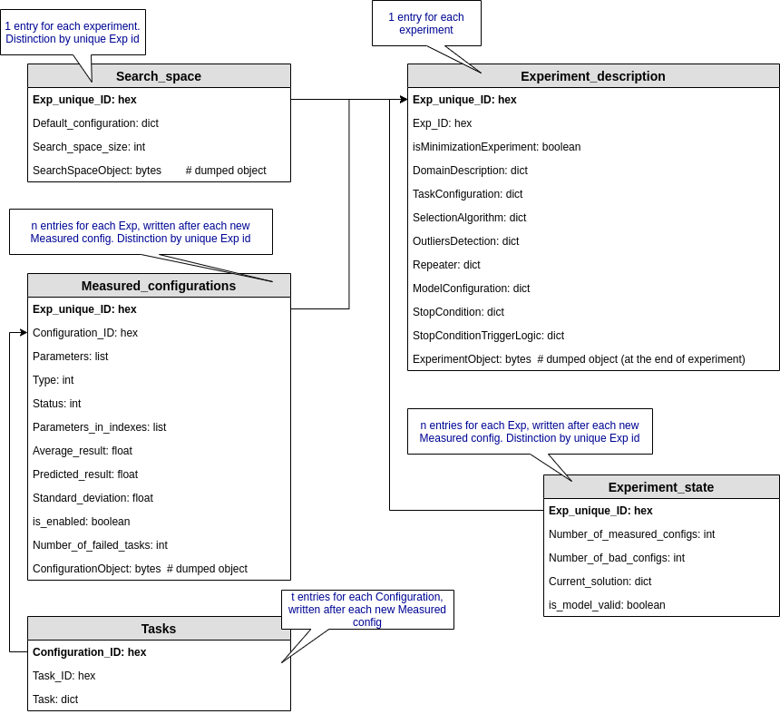

### General information about the database usage in BRISE

BRISE uses [MongoDB](https://www.mongodb.com/), which has a convenient [Python driver](https://api.mongodb.com/python/current/), as a database system. 

**The purpose of using the database in BRISE** is to store the states and results of multiple experiments being executed and to allow BRISE services to exchange their data.

Currently 3 variants of MongoDB location are supported in BRISE:
1. **Remote database on server** (by default) - our remote database located on the server is used (database access parameters and credentials can be found in main-node/Resources/SettingsBRISE.json).
2. **Local database in container** - if you want to use your own local database, please proceed with the following steps:
    - uncomment the lines starting with `mongo-db:` in docker-compose.yml - with these settings the database with the name `BRISE_db` is created localy on BRISE start up and filled in during the Experiments' run. 
    - adjust the main-node/Resources/SettingsBRISE.json file (e.g. `"Address": "localhost"`, `"DatabaseUser": "admin"`, `"DatabasePass": "5V5Scp1E"`). Please note, that you may create your own database user - then you need to adjust this data consistently.
    - add mongo-db to the list of services to be run locally (in brise.sh correct the line: `services=("main-node" "event_service" "worker_service" "front-end" "worker" "mongo-db")`)
    - if you run the local database with the admin rights (by default), remove the `authSource` parameter from the connection string in main-node/tools/mongo_dao.py: `self.client = pymongo.MongoClient(mongo_host + ":" + str(mongo_port), username=username, password=password, authSource=database_name)`
3. **Remote database in the k8s cluster** - you may have your MongoDB running in the remote k8s cluster. The deployment file is already pre-setted for this purpose (see K8s/mongo-db-deployment.yaml). Please check the credentials and change the database address in main-node/Resources/SettingsBRISE.json respectively.

The name of the database, its address and port can be customized during the BRISE startup (please, see the run options of the `./brise.sh up` command).

#### BRISE database structure

An overview of the information stored in the database is shown in the following diagram:

#### BRISE database clean up

By default the data is being appended to the database as long as the `mongo-db` container exists. If you want to clean the database, please, use `./brise.sh clean_database`. The details you may find using `./brise.sh help` command.

#### Useful commands
For the debugging purposes you may login to the database server (via SSH) and access the database manually using MongoDB console. To run the MongoDB console type `mongo --username database_user --password database_pass 127.0.0.1/BRISE_db` - please, note that you need to login with the respective credentials (see main-node/Resources/SettingsBRISE.json).
When the console is running, switch to the used database with `use database_name` (`database_name`=`BRISE_db` by default). Here you can list the collections or perform other actions you may be interested in. Useful mongo Shell commands you may find at [mongo Shell Quick Reference](https://docs.mongodb.com/manual/reference/mongo-shell/).
